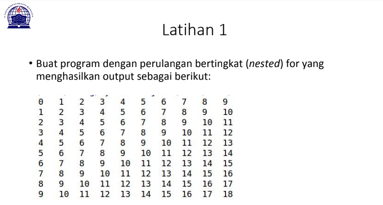

# Tugas Pertemuan 7 - Pertemuan7
Repository ini dibuat untuk memenuhi tugas pada pertemuan ke7
<hr>

Nama    : Pikri Ramdani<br>
Nim     : 312010162<br>
Kelas   : TI.20.A.1<br>
<hr>

Pada modul kali ini saya di beri 2 tugas untuk membuat program sederhana menggunakan bahasa pemrograman python.<br>

### Latihan 1<br>

* Di tugas ini saya diminta untuk membuat membuat program sederhana seperti gambar dibawah ini:<br>
<br>

* Setelah membaca dan memahami materi yang diberikan oleh dosen, pada akhirnya saya telah selesai membuat program tersebut, dengan source code seperti dibawah ini :
``` python
print(list(range(0, 10, 1)))
print(list(range(1, 11, 1)))
print(list(range(2, 12, 1)))
print(list(range(3, 13, 1)))
print(list(range(4, 14, 1)))
print(list(range(5, 15, 1)))
print(list(range(6, 16, 1)))
print(list(range(7, 17, 1)))
print(list(range(8, 18, 1)))
print(list(range(9, 19, 1)))

```


